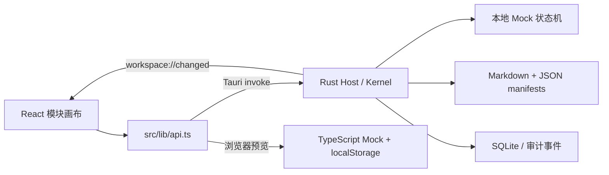

# P0 架构说明

## 0.1.4 当前架构与权限

本节覆盖下方历史0.1.2及更早说明中“Kernel内置Mock／stdio不启动／尚无Connector”的旧状态。后文保留的数据与UI职责仍适用，具体差异如下。

- `agent/mod.rs` 定义 AgentConnector 与事件信封，`mock.rs` 拥有 Mock 分类、流式文本、提案生成和取消；Kernel 只消费事件、执行Host策略与持久化。
- `workspace_tools.rs` 是进程内最小HostWorkspaceTools/ToolGateway；模块/文件提案只在Kernel校验后应用。Native ACP 的tool_call通知只记录状态，不当作工具RPC重复执行。
- `agent/native.rs` 是独立worker与有界NDJSON I/O队列，结构化argv启动Hermes；客户端声明fs=false/terminal=false，不虚报Host工具能力。session/new映射先持久化并ack后才允许prompt。正常多轮复用provider会话，cancel/dispose/权限变更后回收并新建会话。
- Native stderr仅提取固定诊断类别，不保留原始提示词或配置内容。请求、帧、文本和队列均有上限，握手/任务/取消有期限。按自建PID/进程组及已观察的PID启动身份清理后代，不按进程名称误杀独立实例。未观察前即脱父的daemon不构成已证明的OS沙箱；界面不宣称完整工具隔离。
- `policy.rs` 在渠道应用目录保存系统三态和局部四态。局部键使用规范化root、dev/ino与workspaceId，复制路径不继承信任。原有restricted保守迁移。实际权限变化增加epoch并终止旧Agent；被覆盖的局部偏好改变不会误取消。
- user/agent来源由不同可信Host入口的ActionOrigin赋值，不能由描述符名字或请求字段伪造。禁止Agent不禁止用户手动编辑；用户批准Agent提案仍是Agent操作。完全访问只自动处理新且有效的提案，仍保留revision/schema/path检查。
- 前端发送root+generation，事件再校验workspaceId/root/generation/runId/runtimeSessionId/permissionEpoch/seq。原生权限requestId存于运行期映射，重启不会重放，普通文档审批按epoch恢复。
- `get_app_info` 返回真实包身份及candidateId/buildId/sourceFingerprint；前端比较内嵌构建身份，避免拼装不一致的包。原生runStatus与连接状态分开表示。

真实Hermes的受限/只读禁用；询问模式要求明确本机运行范围确认，且只控制实际发来的ACP审批。默认Hermes可加载自身记忆；本轮验收使用私有HERMES_HOME profile仅引用既有模型配置，不携带原memory/skills/history。此profile可能含认证配置备份，绝不打包。

应用退出与工作区切换显式shutdown并等待回收；停止失败会保留停止中/错误状态并禁止新任务。数据持久化失败也回收Agent，保留恢复记录，不报告成功。

## 0.1.3 P0 可靠性收尾（候选验收中）

工作区现在持有规范化物理目录 fd 的进程间独占锁，渠道独占锁单独持有到应用退出；SQLite 连接在工区锁之前释放。启动与动作边界另检查旧版可写文件句柄，因为旧版不遵守新锁。进程异常退出由 OS 释放锁，目录 inode 被替换时停止写入。advisory 锁仍不能强制约束重新启动的不合作旧程序，数据接管需正常退出旧写入者并完整备份。

每次 Kernel::open 生成新的 workspaceGeneration；前端及 Host 对操作验证 root+generation，避免 A→B→A 将旧调用误认成当前会话。

文件/SQLite 恢复使用最小 durable journal：write_operations 记录已批准文档写入的 before/after hash；create_operations 在创建文件前持久化确定的模块 ID/数据；pending_commit 在写模块 manifests 前持久化待提交快照和审计。最终数据库事务一起提交快照、索引、审计、操作状态并清除 pending。恢复检测 after hash 时只补状态不重复写；before hash 保留待处理审批；不同 hash 标冲突并保留外部正文。存储失败返回错误并停止继续动作，重新打开恢复；不把分步写入称作跨存储原子事务。

候选来源通过 scripts/candidate.mjs 归档与校验，1422 只使用独立冻结目录。详情见 CANDIDATES.md。0.1.3 的完整验证结果以 Handoff 与该候选报告为准。

## 0.1.2 版本与渠道身份

Web 构建从 package.json 注入基础版本与 web 渠道。原生 `get_app_info` 从运行包读取真实版本、名称、identifier、executablePath 和 dataDir；`dev.pixel.workspace.dev` 对应 dev，`dev.pixel.workspace` 对应 beta，未知标识拒绝确认。UI 只持有一份 AppInfoState，左上／侧栏／设置／页面标题共用；原生窗口标题由 Host 同源设置。加载失败明确显示“版本未确认”。

`tauri.dev.conf.json` 覆盖 Dev 名称与标识，隔离默认数据及 workspace-selection.json。Vite 的 web/native-dev/native-beta 模式输出到不同目录；1421 为 Web 热更新，1422 为 Web 构建预览，1420 由原生 Dev 管理。构建前脚本核对版本及渠道配置，裸 npm Tauri dev 命令默认补 Dev 配置。

构建的临时应用归档到 `work/builds.noindex/`，应用名区分 Dev/Beta；Beta 体验安装入口由交付流程单独核对。默认目录隔离不替代工作区级进程锁，后者仍待实现。

本版把「可以操作的个人工作区」与「真实 Agent 接入」分开推进。React 负责模块界面与交互；原生 Rust Host 负责工作区、审批、文件写入与持久化。唯一可运行的 Agent 是 Host 内置 Mock。

## 运行路径



`api.ts` 通过 Tauri 环境标识选择后端。桌面版使用 `get_workspace`、`open_workspace`、`dispatch` 三个 Tauri command；浏览器版懒加载 `preview.ts`。两者共享 TypeScript DTO，但浏览器版没有原生文件和权限保证。

`dispatch` 的 IPC 参数除 `action` 外还必须包含 `expectedRoot`，Host 在互斥锁内核对当前根目录后才执行动作。工作区切换只发布最终激活的快照，不发布旧工作区的取消快照；前端只有显式打开成功才能切换根目录，普通事件和动作响应不能跨根切换。当前工作区内以审计序号过滤乱序事件，序号相同时才比较更新时间。切换期间阻止重复选择和提交动作，失败后重新读取 Host 状态。

## 前端模块

| 文件 | 职责 |
| --- | --- |
| `App.tsx` | 工作区快照、导航、全局输入、审批弹窗、错误反馈与事件订阅 |
| `components/Canvas.tsx` | 模块布局、拖动、尺寸调整、键盘操作、聚焦与模块菜单 |
| `components/ModuleContent.tsx` | 对话、规划、文档、看板四类内置内容 |
| `components/ModuleErrorBoundary.tsx` | 隔离单个模块渲染错误，提供重试 |
| `components/Panels.tsx` | 创建模块、设置、审批、模块属性与事件列表 |
| `lib/types.ts` | `WorkspaceSnapshot`、模块、审批和动作契约 |
| `lib/layout.ts` | 24 列网格约束、碰撞下移与布局整理 |

画布横向 24 列，行高 8 px，卡片间距 12 px。前端默认把碰撞模块下移，可选择允许重叠；Host 校验布局数值边界。布局宽度范围为 6–24 列，高度范围为 24–120 行。

文档使用 `react-markdown`，不启用原始 HTML；外部图片不直接加载。编辑器在开始编辑时记录 revision，流式消息更新不会替换本地草稿。请求失败保留草稿，提交写入后等待审批结果。

`lib/document-drafts.ts` 按 `[rootPath, moduleId]` 保留会话内编辑状态，React 组件卸载不删除草稿。批准成功或用户明确取消编辑时清除缓存，拒绝和 revision 冲突保留内容及原 revision。该内存缓存不提供未提交草稿的跨进程恢复。任务标题按 Unicode 码点限制为 120 字符，与 Rust `chars()` 一致。

## Host 与 Mock 生命周期

`lib.rs` 维护 `Mutex<Result<Kernel, String>>`，串行处理动作，向前端发送最新快照。后台线程每 150 ms 调用 `Kernel::tick()`，推进 Mock 输出；异常通过 `workspace://error` 传递。

`kernel.rs` 包含工作区状态、动作校验、模块管理、Mock 意图规则、审批、文件入口、审计与持久化。Mock 按提示词识别创建模块、修改文档、普通对话、失败及慢速输出，生成预设内容。

```text
idle/completed/failed/cancelled
  → running
  → completed / failed / waiting_approval
  → 用户审批或拒绝
  → completed
```

取消会停止后续输出并撤销待处理审批。运行任务或存在审批时，Host 拒绝开始新任务或替换 Agent 描述。重启后未完成的运行标为取消；待审批操作恢复为 `waiting_approval`。这属于工作区状态恢复，不是跨进程继续执行 Agent。

会话只记录选中模块的引用范围。当前没有把整个文件系统、完整工作区内容或密钥传给任何模型。

## 审批与文件写入

1. 编辑器或 Mock 提交修改意图。Host 读取工作区中的当前正文，生成 `before` / `after` 与原文 revision。
2. Host 保存审批并发出快照；界面展示差异。手动保存不会直接覆盖文件。
3. 前端只提交 `approvalId` 与 `allow`。Host 查找自己保存的审批，核对权限、目标模块和文件路径。
4. 写入前重新验证 SHA-256 revision；内容变化或路径变化时拒绝应用。
5. 在目标目录创建临时文件，写入并同步，在提交前再次校验后 `rename` 替换，再同步父目录。失败会清理临时文件。
6. 记录审计事件并更新模块与会话状态。

工作区入口规范化根目录，拒绝绝对路径、`..` 及符号链接越界。受限模式在 Host 拒绝审批应用，不依赖前端按钮。该入口面向当前单 Host 的本地工作流；不宣称对恶意并发本地进程提供操作系统级沙箱。

Markdown、各份 JSON 与 SQLite 并非一个跨存储事务：文件分别进行原子替换，数据库的快照与索引在事务中更新。不要把当前实现当作多进程协作数据库。

## 数据来源与恢复

| 数据 | 位置 / 来源 |
| --- | --- |
| 文档正文 | `notes/<module-id>.md`，每次快照按当前文件刷新 |
| 模块索引与工作区设置 | `.workspace/workspace.json` |
| 模块状态、任务、布局 | `.workspace/modules/<module-id>.json` |
| 会话、消息、审批、快照索引 | `.workspace/workspace.sqlite3` |
| 完整审计历史 | SQLite `events` 表；界面只加载最近 200 条 |
| 最后使用的工作区 | Tauri 应用数据目录 `workspace-selection.json` |

SQLite 使用 WAL、外键与 `synchronous=FULL`。表包括 `metadata`、`modules`、`messages`、`approvals`、`sessions`、`events`；审计表通过 trigger 禁止 update / delete，事件按 seq 递增。

启动优先读取工作区 manifest 和模块 JSON，文档正文以 Markdown 为准。丢失 SQLite 时可从 manifests 重建模块索引，但无法从文档文件恢复完整聊天、审批和审计历史。缺失 manifest 时可借助 SQLite 中的快照重建索引。损坏或不支持的 schema 会报错，不静默清空现有内容。

本版无 watcher：外部文件变化在下一次获取快照时读取。直接移出画布保留文件，未提供文档文件删除命令。

## 原生边界与后续接口

Tauri capability 仅启用 core 与显式目录选择。生产 CSP 限制脚本、iframe 和连接来源；业务没有网络或终端执行工具。Agent 描述只允许 `mock` / `stdio`，对工作目录、参数长度和允许的环境变量做校验，并拒绝常见明文凭据配置。

`stdio` 的保存、探测只确认描述格式，状态保持未连接。未来可在 Host 中加入真实 ACP transport，再复用现有审批与工作区动作；不能绕过 Host 直接让 WebView 执行命令或写文件。

Agent cwd 保存前解析并规范化为相对工作区路径；启动时仅依据旧 SQLite 快照记载的原 root 迁移旧绝对 cwd，再执行目录存在和 symlink containment 检查。没有旧 root 依据的外部路径继续拒绝。

尚未实现：Agent 进程管理、ACP 消息编解码 / 能力协商、真实模型会话续接、网络/终端审批模型、文件监听与全文索引、模块插件隔离、并行调度和远程同步。
